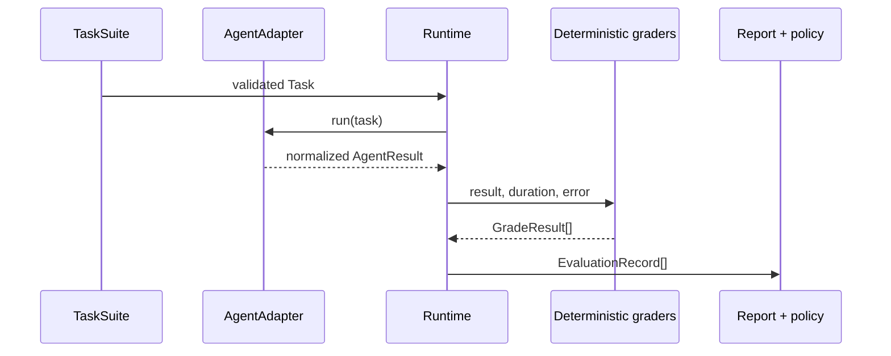

# Architecture

Agent Eval Lab keeps the boundary between an agent and its evaluation stable.

## Domain model

- `Task` is immutable, versioned through its suite, and declares only observable expectations: expected/required/allowed/forbidden tools, ordered subsequences, output fields/types, call and retry budgets, approval/escalation boundaries, tags, and non-sensitive metadata.
- `AgentResult` normalizes text, tool calls, structured output, retries, token/cost telemetry, provider/model identifiers, and errors. Telemetry is optional.
- `GradeResult` is inspectable: grader name, score, reason, metadata, and failure taxonomy.
- `EvaluationRecord` combines the task, measured duration, grades, attempts, and visible error.

## Boundaries

The runner owns timing, bounded retries for `RetryableAgentError`, and failure capture. Graders are small deterministic objects; new graders can implement `grade(task, result, duration_ms, error)`. Reporters consume records and do not invoke agents. Provider adapters live in `adapters.py`; they return common contracts and do not leak HTTP or SDK types into the core.

The design intentionally does not supply a universal agent runtime, parallel scheduler, database, or tracing backend. Those are deployment choices. A domain agent only needs the minimal `run(task) -> AgentResult` protocol.

## Reference integration subject

`support_ops.py` is intentionally outside the evaluation core. Its bounded rule runtime executes deterministic synthetic support tools and exposes the same `AgentAdapter` protocol as any user agent. It demonstrates stateful tool calls, retryable tool faults, approval-before-sensitive-action, and escalation without turning this package into an agent framework. Its `support-operations` v1.0 suite is integration evidence, not a hosted-model benchmark.
