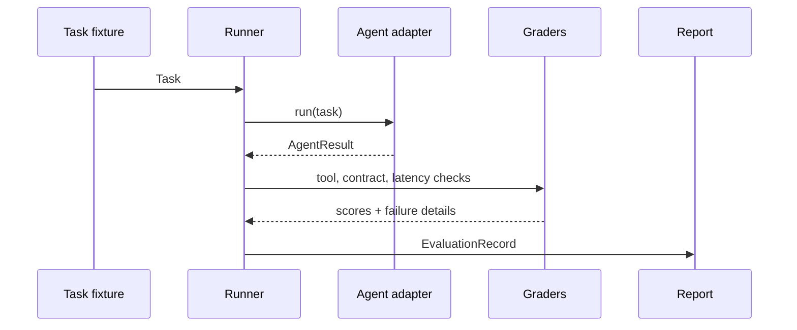

# Architecture

## Design goal

Keep the evaluation core deterministic and independent of a particular LLM vendor, tool framework, or tracing product.

## Components

- **Task fixtures** are JSON files kept in version control.
- **Agent adapter** is a thin integration boundary for a real model, workflow, or mock.
- **Runner** measures duration, captures exceptions, and returns a record for every task.
- **Graders** are deterministic predicates rather than an LLM judge.
- **Report** summarizes pass rate and only reports cost/token values when supplied by the adapter.

## Extension points

Future adapters can add model routing, tracing, OpenTelemetry export, or external evaluators without coupling those choices to task definitions.
