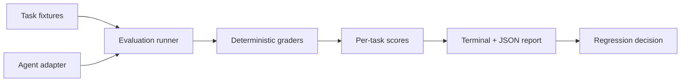

# Agent Eval Lab

[](https://github.com/alimokhtari-ai/agent-eval-lab/actions/workflows/ci.yml)

An offline-first evaluation harness for testing whether an AI agent selects the right tool, returns valid structured data, respects latency budgets, and fails transparently.

It is deliberately small: a reproducible foundation for agent evaluation, not a benchmark with invented model scores.

## Why this exists

An agent demo is not evidence of reliability. Before connecting an agent to real tools, teams need a repeatable way to test task success, tool choice, output contracts, latency, errors, and estimated cost.

## What it evaluates

- expected tool selection;
- required structured-output fields;
- latency budgets;
- exception handling and failure visibility; and
- optional token and cost telemetry supplied by an adapter.

## Architecture



## Quick start

Requires Python 3.11+ and no third-party packages.

```bash
git clone https://github.com/alimokhtari-ai/agent-eval-lab
cd agent-eval-lab
PYTHONPATH=src python -m agent_eval_lab --tasks evals/tasks/tool_use.json
```

Run the tests:

```bash
PYTHONPATH=src python -m unittest discover -s tests -v
```

## Example output

The included deterministic mock adapter exercises the harness without an API key. Its result is a test fixture, **not** a claim about a production LLM:

```text
Tasks evaluated: 3
Tasks passed: 3
Task success rate: 100.0%
Average latency: <measured locally>
Token and cost telemetry: not reported by this adapter
```

## Add a real agent

Implement the `AgentAdapter` protocol from `agent_eval_lab.contracts`. The adapter receives a `Task` and returns an `AgentResult`, including tool calls, structured output, optional token counts, optional estimated cost, and retry count.

This separation keeps model SDKs, credentials, and production integrations out of the evaluation core.

## Evaluation methodology

See [EVALS.md](EVALS.md) for task design, scoring, reproducibility, and limitations.

## Engineering notes

- [ARCHITECTURE.md](ARCHITECTURE.md)
- [DECISIONS.md](DECISIONS.md)
- [SECURITY.md](SECURITY.md)
- [CONTRIBUTING.md](CONTRIBUTING.md)
- [ROADMAP.md](ROADMAP.md)

## Status

The repository runs tests, a compilation check, and an offline evaluation smoke test on every push and pull request.
