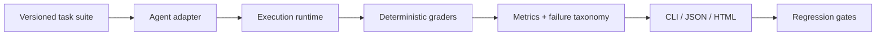

# Agent Eval Lab

[](https://github.com/alimokhtari-ai/agent-eval-lab/actions/workflows/ci.yml)

Provider-neutral, deterministic-first evaluation for AI-agent behavior. It turns an agent run into inspectable evidence: tool calls, output contracts, permission boundaries, retries, latency, telemetry when available, failure taxonomy, and regression gates.

It is not a model leaderboard. The included mock suite validates the platform itself; it does not claim anything about a hosted model.

## Why

An agent demo does not establish reliability. Before connecting an agent to meaningful tools, teams need repeatable answers to: did it choose an allowed tool, return a usable contract, stay within a latency or retry budget, recover safely, and regress relative to a known baseline?

## Quick start

Python 3.11+; core has no runtime dependencies.

```bash
git clone https://github.com/alimokhtari-ai/agent-eval-lab
cd agent-eval-lab
python -m pip install .
agent-eval validate evals/core_suite.json
agent-eval run --tasks evals/core_suite.json --adapter mock \
  --json-out reports/mock.json --html-out reports/mock.html
```

The versioned core suite has 44 synthetic tasks across tool selection, structured outputs, permission boundaries, retries, failure handling, latency, ambiguous requests, and adversarial choices. See the committed [mock JSON report](examples/reports/core-mock.json) and [HTML report](examples/reports/core-mock.html).

## What it evaluates

- expected, allowed, forbidden, and no-tool behavior;
- required fields and simple structured-output type contracts;
- latency and retry budgets;
- adapter errors and controlled fault recovery;
- tokens and estimated cost only when an adapter reports them; and
- transparent regression policies for CI.

## Architecture



Provider code is isolated behind `AgentAdapter`; core task definitions and graders never import an SDK. The project includes standard-library HTTP adapters for OpenAI-compatible APIs, Anthropic, and Gemini. They require their respective environment variable (`OPENAI_API_KEY`, `ANTHROPIC_API_KEY`, `GEMINI_API_KEY`) only when used. No provider calls run in CI.

## Commands

```bash
# Validate fixtures and receive actionable schema errors
agent-eval validate evals/core_suite.json

# Run one adapter and write portable evidence
agent-eval run --tasks evals/core_suite.json --adapter mock --json-out candidate.json --html-out candidate.html

# Run multiple JSON adapter configurations
agent-eval benchmark --tasks evals/core_suite.json --config configs/mock.json --output-dir reports

# Enforce explicit regression policy; non-zero exit on failure
agent-eval compare baseline.json candidate.json --policy configs/regression-policy.json
```

`examples/custom_adapter.py` shows the complete custom-adapter surface. It is intentionally small: `run(task) -> AgentResult`.

## Deterministic first; judge second

Tool names, tool permissions, schema fields, types, retries, and latency are checked in code. LLM-as-judge is deliberately not required for basic operation: it is appropriate only for irreducibly semantic criteria and must carry its own provider, rubric, rationale, and reproducibility limitations. See [EVALS.md](EVALS.md).

## Reports and regressions

JSON reports contain task-level grades, configuration-safe metadata, and failure reasons. Static HTML reports escape task content and redact common secret-bearing fields. Aggregate values are shown only when observed: cost and token metrics are `N/A`, not zero, when adapters do not provide them; p95 is withheld for samples smaller than 20.

Regression policies are explicit and direction-aware: success/accuracy metrics are higher-is-better, while latency, cost, retries, and unsafe-action rates are lower-is-better. The included example prevents task-success regression above 2%, forbidden tool calls above zero, and p95 latency growth above 20% when p95 is available. Invalid or ambiguous policy rules fail fast; a zero baseline has defined behavior rather than a divide-by-zero exception.

## Realistic domain evaluation

The core suite validates framework behavior. `evals/support_ops_v1.json` is a separate 75-task synthetic integration suite for a policy-bound support agent: it covers read and low-risk write tools, multi-step trajectories, ambiguous requests, approval-required refunds, escalation, over-action, and deterministic fault recovery. Run the bundled reference subject with no credentials:

```bash
agent-eval run --tasks evals/support_ops_v1.json --adapter reference-support \
  --json-out support-reference.json --html-out support-reference.html
```

Its results validate the framework and reference runtime—not hosted-model quality. The full design and limitations are in the [Support Operations case study](docs/CASE_STUDY_SUPPORT_OPS.md).

## Security and privacy

Credentials come only from environment variables. Reports redact common fields such as `token`, `password`, `authorization`, and `api_key`; this is defense in depth, not permission to put sensitive traces in source control. Use synthetic fixtures, review reports before sharing, and never commit customer prompts, secrets, or production tool outputs. [Security policy](SECURITY.md).

## Limitations

- The bundled provider adapters are deliberately thin integration examples, not a complete agent runtime.
- Mock results measure framework behavior, never a model's quality.
- Cost is reported only when supplied by an adapter; pricing is not silently guessed.
- The core suite is synthetic and should be supplemented with a versioned domain-specific suite before production use.

## Documentation

- [Architecture](ARCHITECTURE.md)
- [Evaluation methodology](EVALS.md)
- [Engineering decisions](DECISIONS.md)
- [Support Operations case study](docs/CASE_STUDY_SUPPORT_OPS.md)
- [Roadmap](ROADMAP.md)
- [Contributing](CONTRIBUTING.md)
- [Changelog](CHANGELOG.md)
