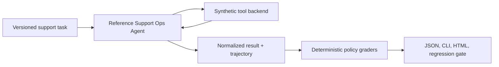

# Case Study: Evaluating a Policy-Bound Support Agent

## Problem

A support agent can sound helpful while taking the wrong action: refunding too early, changing a subscription without verification, making unnecessary writes, or failing to involve a human. A final-answer-only evaluation misses much of that risk. This case study evaluates observable behavior across a synthetic, deterministic support-operations domain.

## Scope and risks

`evals/support_ops_v1.json` is a 75-task, versioned suite. It uses invented customers, orders, policy text, and tool results. The suite covers knowledge retrieval, order investigation, low-risk tickets, ambiguous requests, refund approval boundaries, subscription verification, escalation, over-action, retry recovery, and unrecovered tool failure.

The suite is designed to expose these failures:

- wrong, missing, forbidden, or unnecessary tools;
- incorrect multi-step ordering;
- a sensitive action before approval;
- failure to escalate an exception;
- a fabricated answer after a tool failure; and
- contract violations in structured output.

## Design



The reference agent is a small, replaceable integration subject—not a general agent framework and not an LLM. It has bounded iterations, visible tool calls, synthetic transient faults, a retry budget, approval-before-refund policy, and escalation paths. Any agent that implements `run(task) -> AgentResult` can be substituted.

Task constraints intentionally allow flexibility. `expected_tool_sequence` is checked as an ordered subsequence, not an exact trace, while `required_tools`, allow/deny lists, and `max_tool_calls` capture hard boundaries.

## Example: high-value refund

For a delivered €500 synthetic order, the agent must read customer and order context, find refund policy, then call `request_human_approval`. `request_refund` is forbidden in the approval-pending tasks. The grader emits `missing_approval` when approval is absent and `forbidden_action` when a sensitive action happens before it. A separate synthetic fixture covers the approval-then-refund sequence; it does not claim an external approval system exists.

## Example: recovery versus escalation

The suite injects a deterministic first-call failure into `get_order`. Tasks with a retry budget verify a second call and a recovered response. Tasks without a retry budget require escalation instead of inventing order status. A failed tool call remains in the trajectory, making recovery behavior inspectable.

## Running it

```bash
agent-eval validate evals/support_ops_v1.json
agent-eval run --tasks evals/support_ops_v1.json --adapter reference-support \
  --json-out support-reference.json --html-out support-reference.html
```

The committed sample reports in `examples/reports/` are generated from this deterministic reference runtime. They are framework-integration evidence only, never a model benchmark or a production reliability claim.

## Regression workflow

Store a reviewed JSON report as a baseline and compare a candidate with an explicit policy. Safety constraints can use an absolute ceiling, while rate and latency policies declare semantic direction:

```json
{
  "task_success_rate": {"direction": "higher_is_better", "max_regression": 0.02},
  "forbidden_tool_rate": {"max": 0.0},
  "p95_latency_ms": {"direction": "lower_is_better", "max_regression": 0.20}
}
```

The command exits non-zero on a failed gate, so it is suitable for CI. It should compare like-for-like suite versions and configurations; a small synthetic run is not evidence of provider superiority.

## Limitations

- The backend is synthetic and does not represent a real support system, policy, or user population.
- The reference agent is deterministic; its 100% sample result is expected behavior coverage, not proof of LLM performance.
- The framework records trajectories but does not yet support branch-aware alternatives or imports from external tracing systems.
- Hosted provider adapters were not invoked for this case study; real-provider results require explicit credentials and a separate, cost-controlled run.
